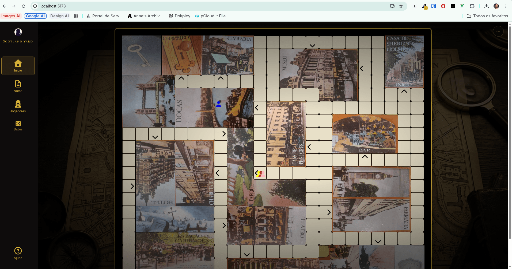

# Scotland Yard

Scotland Yard is a board game in which a group of players tries to solve a crime, as if they were Sherlock Holmes.




# Tech

This project was bootstrapped with [Create React App](https://github.com/facebook/create-react-app).

## Available Scripts

In the project directory, you can run:

### `yarn dev`

Starts the game server and Vite frontend together. Open [http://localhost:5173](http://localhost:5173) in the browser.

### `yarn start`

Runs only the Vite frontend.

### `yarn server`

Runs only the Node game server on port 3001.

### `yarn test`

Runs the Vitest test suite.

### `yarn build`

Builds the frontend for production into the `dist` folder.

## Database (Turso)

The game server uses SQLite through [Turso](https://turso.tech/) via `@libsql/client`. In production, set:

```bash
TURSO_DATABASE_URL=libsql://your-database-name-your-org.turso.io
TURSO_AUTH_TOKEN=your-turso-auth-token
```

For local development, the server falls back to `server/data/rooms.db` when those variables are not set.

Copy `.env.example` to `.env` and fill in your Turso credentials before deploying.

## Clearing saved games

Room state is persisted in Turso (production) or locally in `server/data/rooms.db` (development). To remove all saved games and start fresh (for example, after a server update or when a room is stuck in an old game phase), stop the server and either delete the local file or clear the `rooms` table in Turso:

```bash
rm server/data/rooms.db
```

The database is recreated automatically the next time you run `yarn dev` or `yarn server`.

## Learn More

You can learn more in the [Create React App documentation](https://facebook.github.io/create-react-app/docs/getting-started).

To learn React, check out the [React documentation](https://reactjs.org/).

### Code Splitting

This section has moved here: https://facebook.github.io/create-react-app/docs/code-splitting

### Analyzing the Bundle Size

This section has moved here: https://facebook.github.io/create-react-app/docs/analyzing-the-bundle-size

### Making a Progressive Web App

This section has moved here: https://facebook.github.io/create-react-app/docs/making-a-progressive-web-app

### Advanced Configuration

This section has moved here: https://facebook.github.io/create-react-app/docs/advanced-configuration

### Deployment

This section has moved here: https://facebook.github.io/create-react-app/docs/deployment

### `yarn build` fails to minify

This section has moved here: https://facebook.github.io/create-react-app/docs/troubleshooting#npm-run-build-fails-to-minify

### To fix node version problem:

- nvm use 14.4.0

### Resources

- modal: https://micromodal.now.sh/
- editor: https://github.com/jpuri/react-draft-wysiwyg
